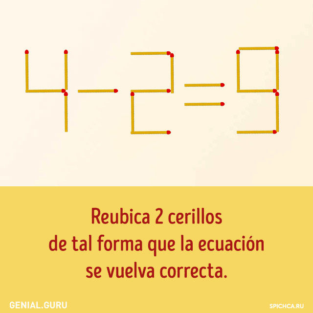
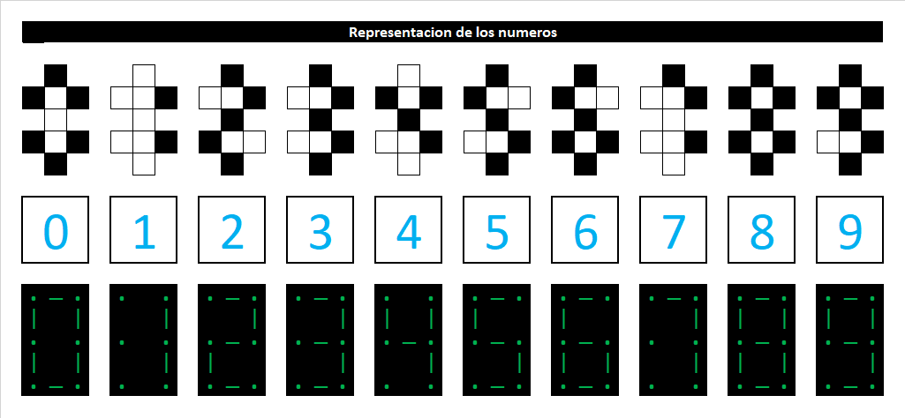
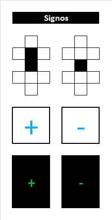
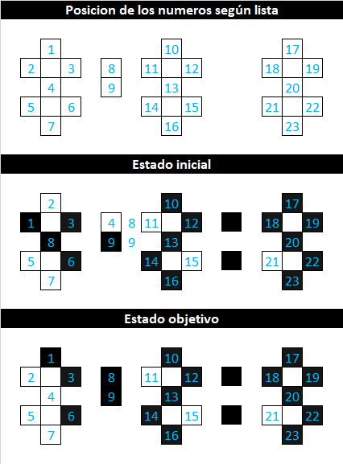
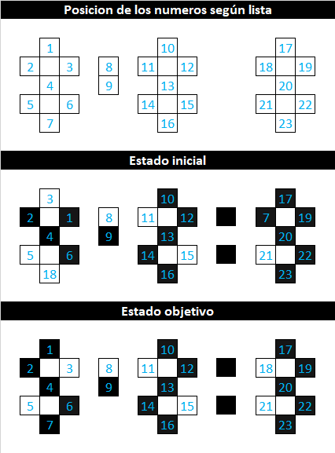

# Primer Parcial de Inteligencia Artificial I
> __Autor:__ Daniel Quispe Taboada  
> __Docente:__ Pacheco Lora Carlos Walter  
> __Carrera:__ Ingenieria de Sistemas  

El ejercio que me toco es el 8, el siguiente:   
  

Para la representacion de los numeros y signos se realizo de la siguiente manera:  
  
  

Para encontra la solucion se enumero a los palitos:  
  
1. Primero se muestra las posiciones de los valores segun una lista
2. En el segundo se muestra el estado inicial con su enumeracion respectiva
3. Se muestra como se ve la solucion

Se encuentra la solucion po el ordenamiento de sus numeros yendo del 1 hasta 23 sin considerar el signo de igual, para no alterar el mismo
 Mi Examen se encuentras __[aquí](./QuispeTaboadaDaniel_1P.ipynb)__.
<!--
##Solucion 5 - 2 = 3
initial_state = [[3, "V"], [2, "c"], [1, "c"], [4, "c"], [5, "V"], [6, "c"], [18, "V"],[8, "V"], [9, "c"],[10, "c"], [11, "V"], [12, "c"], [13, "c"], [14, "c"], [15, "V"], [16, "c"],[17, "c"], [7, "c"], [19, "c"], [20, "c"], [21, "V"], [22, "c"], [23, "c"],]
solution_state = [[1, "c"], [2, "c"], [3, "V"], [4, "c"], [5, "V"], [6, "c"], [7, "c"],[8, "V"], [9, "c"],[10, "c"], [11, "V"], [12, "c"], [13, "c"], [14, "c"], [15, "V"], [16, "c"],[17, "c"], [18, "V"], [19, "c"], [20, "c"], [21, "V"], [22, "c"], [23, "c"],]  
  
-->
